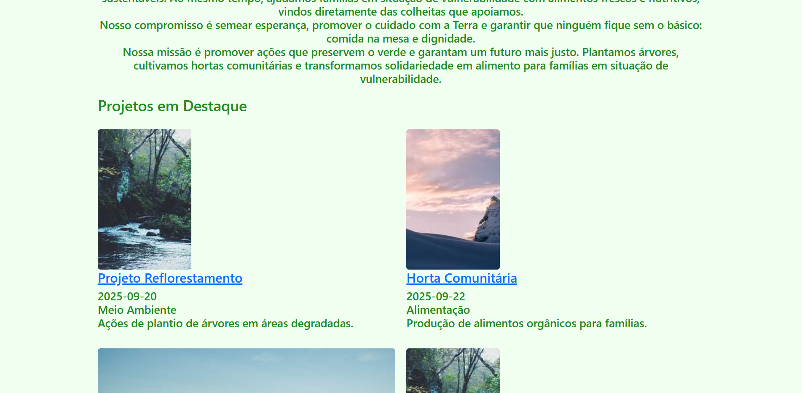

# Trabalho Prático 05 - Semanas 7 e 8

**Páginas de detalhes dinâmicas**

Nessa etapa, vamos evoluir o trabalho anterior, acrescentando a página de detalhes, conforme o  projeto escolhido. Imagine que a página principal (home-page) mostre um visão dos vários itens que existem no seu site. Ao clicar em um item, você é direcionado pra a página de detalhes. A página de detalhe vai mostrar todas as informações sobre o item do seu projeto. seja esse item uma notícia, filme, receita, lugar turístico ou evento.

Leia o enunciado completo no Canvas. 

**IMPORTANTE:** Assim como informado anteriormente, capriche na etapa pois você vai precisar dessa parte para as próximas semanas. 

**IMPORTANTE:** Você deve trabalhar e alterar apenas arquivos dentro da pasta **`public`,** mantendo os arquivos **`index.html`**, **`styles.css`** e **`app.js`** com estes nomes, conforme enunciado. Deixe todos os demais arquivos e pastas desse repositório inalterados. **PRESTE MUITA ATENÇÃO NISSO.**

## Informações Gerais

- Nome:Davi Quintanilha Fideles 
- Matricula:898775
- Proposta de projeto escolhida: 3. Organizações e Equipes	
- Breve descrição sobre seu projeto: Criei uma ong chamada Verde futuro e aqui esta ua descrição de como eu imaginei o projeto dela: 
A Ong Verde Futuro tem como missão apoiar pessoas em situação de vulnerabilidade, oferecendo não apenas ajuda, mas também alimentação saudável e de qualidade para quem enfrenta a fome. Além disso, desenvolve projetos voltados à sustentabilidade, educação e saúde, sempre valorizando seus membros e voluntários. Escolhi esse tema porque considero muito relevante a realidade de pessoas vulneráveis, e acredito que dar visibilidade a essa causa é uma forma de reforçar a importância da solidariedade e da dignidade humana.

## Print da Home-Page

<<   >>

## Print da página de detalhes do item

<<   >>

## Cole aqui abaixo a estrutura JSON utilizada no app.js

```javascript
const dados = [
  {
    id: 1,
    titulo: "Projeto Reflorestamento",
    descricao: "Ações de plantio de árvores em áreas degradadas.",
    conteudo: "Nosso projeto busca restaurar áreas de mata nativa com o plantio de mudas de espécies regionais, promovendo equilíbrio ambiental.",
    categoria: "Meio Ambiente",
    autor: "Equipe Verde Futuro",
    data: "2025-09-20",
    imagem: "https://picsum.photos/200/300"
  },
  {
    id: 2,
    titulo: "Horta Comunitária",
    descricao: "Produção de alimentos orgânicos para famílias.",
    conteudo: "As hortas comunitárias garantem alimentos frescos, geram renda e fortalecem o espírito coletivo entre os moradores.",
    categoria: "Alimentação",
    autor: "Equipe Verde Futuro",
    data: "2025-09-22",
    imagem: "https://picsum.photos/seed/picsum/200/300"
  },
  {
    id: 3,
    titulo: "Educação Ambiental",
    descricao: "Palestras e oficinas para conscientização.",
    conteudo: "Promovemos atividades educativas em escolas e comunidades para difundir práticas sustentáveis.",
    categoria: "Educação",
    autor: "Equipe Verde Futuro",
    data: "2025-09-25",
    imagem: "https://picsum.photos/id/16/900/400"
  }
];

// Função para criar os cards dinamicamente
function carregarProjetos() {
  const lista = document.getElementById("lista-projetos");

  dados.forEach(item => {
    const card = document.createElement("article");
    card.classList.add("caixa-post", "col-md-6");

    card.innerHTML = `
      
      <h3 class="titulo-post">
        <a href="detalhes.html?id=${item.id}">${item.titulo}</a>
      </h3>
      <h4 class="subtitulo">
        <span>${item.data}</span> <br>
        <span>${item.categoria}</span> <br>
        <p class="texto">${item.descricao}</p>
      </h4>
    `;

    lista.appendChild(card);
  });
}

// Chama a função quando a página carregar
window.addEventListener("DOMContentLoaded", carregarProjetos);

```